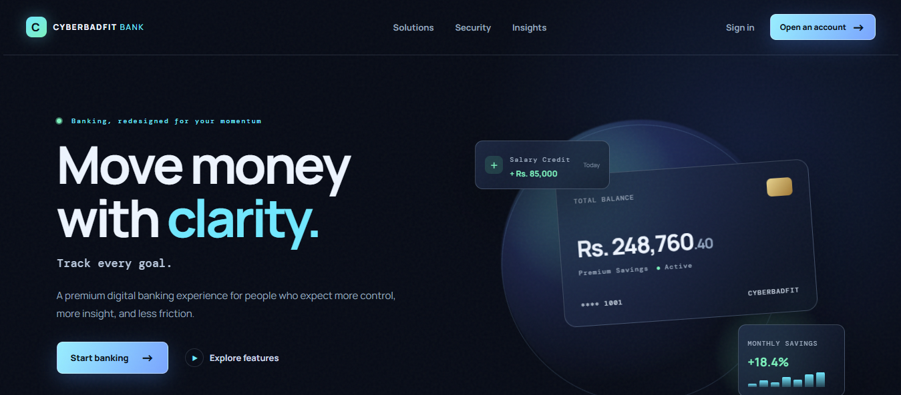

# 🏦 CYBERBADFIT Bank Web

<div align="center">

### A Modern Full-Stack Digital Banking Experience

A dark, responsive banking demonstration built with a clear separation between the public client and private server layers.

[🚀 Run Locally](#-run-locally) • [✨ Features](#-features) • [🔐 Security](#-security) • [📁 Project Structure](#-project-structure)

</div>

---

## 🌐 Website Preview

> A visual preview of the CYBERBADFIT Bank interface.

<p align="center">
  
</p>

### 💳 Money Tools

<p align="center">
  
</p>

### 📊 Personal Banking Dashboard

<p align="center">
  
</p>

### 🔐 Security by Design

<p align="center">
  
</p>

### 📌 Project Footer / Overview

<p align="center">
  
</p>

---

## ✨ Features

### 🏦 Banking Experience
- Modern digital banking interface
- Responsive dark-themed design
- Personal banking dashboard
- Available balance overview
- Monthly spending summary
- Rewards balance
- Recent transaction activity
- Savings goals presentation

### 💸 Money Management
- Transfer-focused banking interface
- Transaction activity tracking
- Savings and financial goal visualization
- Clear confirmation-oriented UI
- Sample banking data for demonstration

### 🔐 Security-Focused Architecture
- PBKDF2-SHA512 password hashing
- Unique random password salts
- Constant-time hash comparison
- Login rate limiting
- Random, expiry-based server sessions
- Input validation
- JSON request body size limits
- Security-focused HTTP headers
- Content Security Policy
- Anti-framing protection
- Protected server-side routes
- DOM APIs used for UI updates instead of injecting untrusted HTML

---

## 🛠️ Technology

| Layer | Technology |
|---|---|
| Frontend | HTML, CSS, Browser-side JavaScript |
| Backend | Node.js |
| Authentication | Server-side authentication & sessions |
| Password Security | PBKDF2-SHA512 + random salt |
| Data Persistence | JSON-based runtime data |
| Server | Node.js built-in modules |
| UI | Responsive dark banking interface |

> The project intentionally uses Node.js built-in modules, so no external package installation is required for the current demo.

---

## 📁 Project Structure

```text
BANK MANAGEMENT SYSTEM/
└── bank-management-website/
    ├── client/
    │   ├── HTML files
    │   ├── CSS
    │   └── Browser-side JavaScript
    │
    ├── server/
    │   ├── API
    │   ├── Authentication
    │   ├── Sessions
    │   └── Data persistence
    │
    ├── server/data/
    │   └── Runtime-only user data
    │
    ├── package.json
    └── README.md
```

### Architecture

```text
                 ┌─────────────────────────┐
                 │       Web Browser       │
                 │   HTML / CSS / JS       │
                 └────────────┬────────────┘
                              │
                              │ HTTP
                              ▼
                 ┌─────────────────────────┐
                 │       Node.js Server    │
                 │                         │
                 │  Authentication         │
                 │  Sessions               │
                 │  API Routes             │
                 │  Request Validation     │
                 └────────────┬────────────┘
                              │
                              ▼
                 ┌─────────────────────────┐
                 │       server/data/      │
                 │   Runtime User Data     │
                 └─────────────────────────┘
```

The server serves the `client/` directory only. Request-path validation is used to help prevent browser access to server code and runtime data files.

---

## 🚀 Run Locally

### 1. Install Node.js

Install **Node.js 18 or newer**.

### 2. Open PowerShell

Navigate to the project directory:

```powershell
cd "BANK MANAGEMENT SYSTEM\bank-management-website"
```

### 3. Start the application

```powershell
npm start
```

### 4. Open the website

Visit:

```text
http://localhost:3000
```

> No `npm install` is required for the current project because it uses Node.js built-in modules.

---

## 🔑 Demo Login

Use the following demo credentials:

```text
Email:    demo@cyberbadfit.bank
Password: DemoBank@2026
```

On the first start, the demo account is created in:

```text
server/data/users.json
```

The dashboard contains five sample transaction entries.

---

## 🔒 Security

This project is designed as an educational demonstration of a more security-conscious full-stack architecture.

### Password Protection

Passwords are protected using:

```text
PBKDF2-SHA512
        +
Unique Random Salt
        +
Constant-Time Comparison
```

### Authentication Protection

The demo includes:

- Rate-limited login attempts
- Expiry-based random sessions
- Protected API routes
- Input validation
- Request body size limits

### HTTP Security

The application also uses security-focused response headers, including:

- Content Security Policy
- Anti-framing protection
- `no-store` API responses

### Server-Side Separation

Sensitive application logic and runtime data remain on the server layer rather than being exposed as public browser assets.

---

## 📱 Responsive Design

The interface is designed to provide a consistent experience across different screen sizes.

Key visual areas include:

- Landing page
- Banking feature cards
- Personal dashboard
- Transaction section
- Security section
- Financial statistics
- Responsive navigation

---

## 🎯 Project Goals

CYBERBADFIT Bank Web was created to demonstrate how a modern banking-style web application can combine:

- Clean UI/UX
- Responsive web design
- Full-stack architecture
- Authentication
- Session management
- Password security
- Request validation
- Server-side data persistence

---

## ⚠️ Production Disclaimer

**This project is a local educational banking demonstration and is NOT a real banking service.**

It must not be used to process real financial transactions or store real banking credentials.

Before using an application like this in production, additional protections would be required, including:

- HTTPS
- Secure `HttpOnly` cookies
- Production-grade database
- Encryption at rest
- CSRF protection
- Distributed rate limiting
- Monitoring and alerting
- Security testing
- Professional security review
- Production-grade deployment architecture

---

## 🧪 Demo Data

The project uses demonstration financial information such as:

```text
Balance:       Rs. 2,48,760.40
Monthly Spend: Rs. 5,620.50
Rewards:       1,250 points
```

These values are for UI/demo purposes only.

---


## 👨‍💻 Developer

<div align="center">

### **CYBERBADFIT**

Full-Stack Web Development • Cybersecurity-Focused Development • Modern Web Interfaces

**Built with 💙 by CYBERBADFIT**

</div>

---

