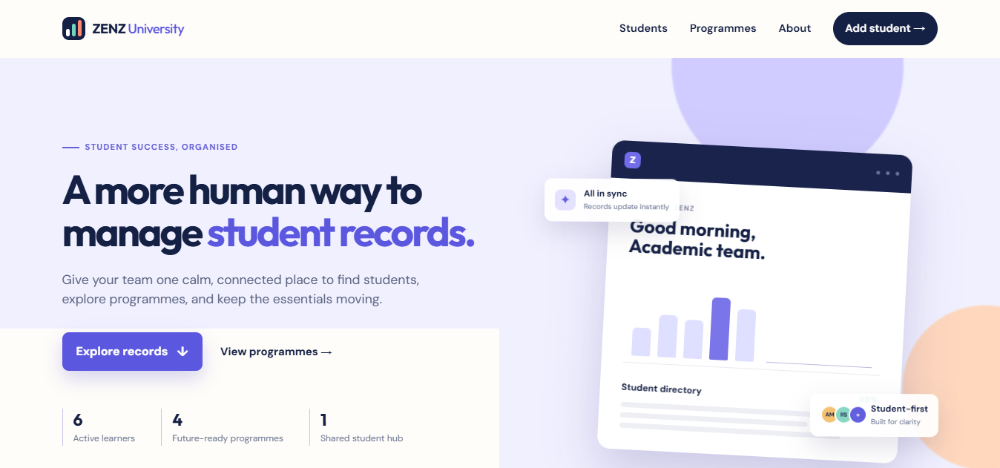
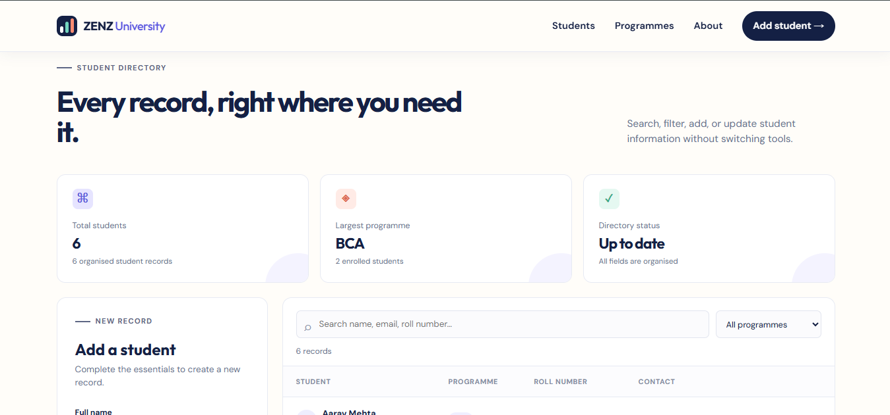
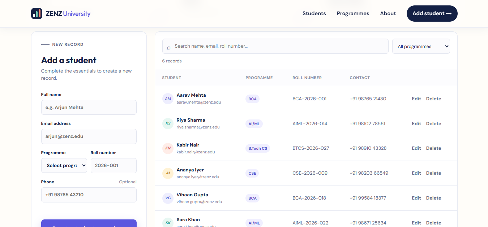
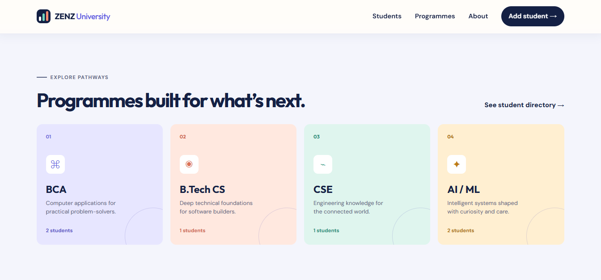
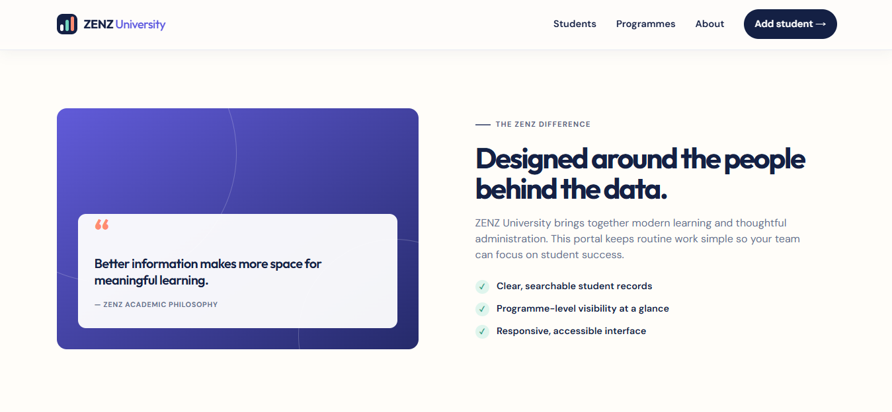

# ZENZ University Student Hub

> A polished, responsive student-management portal built for a clearer academic workflow.


ZENZ Student Hub gives academic teams one place to search, create, update, and organise student records. It combines a modern, mobile-friendly interface with a small Express API and JSON-backed storage—ideal as a clean starter project or a lightweight internal portal.

## Preview

<p align="center">
  
</p>

| Student directory overview | Student records workspace |
| --- | --- |
|  |  |

| Programme cards | About ZENZ University |
| --- | --- |
|  |  |

## Highlights

- Responsive, accessible dashboard with keyboard-friendly controls
- Search student records by name, email, roll number, or programme
- Filter students by BCA, B.Tech CS, CSE, and AI/ML
- Create, edit, and delete student records
- Input validation and duplicate email / roll-number protection
- Seeded sample records for immediate demonstration
- Animated interface with reduced-motion support
- SEO essentials: semantic markup, meta tags, Schema.org data, `robots.txt`, and `sitemap.xml`
- Atomic JSON writes to help keep student data consistent

## Tech stack

| Layer | Technology |
| --- | --- |
| Front end | HTML5, CSS3, Vanilla JavaScript |
| Back end | Node.js, Express |
| Storage | Local JSON file |
| Typography | DM Sans, Outfit |

## Quick start

### Prerequisites

- [Node.js](https://nodejs.org/) 18 or newer
- npm

### Installation

```bash
git clone https://github.com/YOUR-USERNAME/zenz-student-hub.git
cd zenz-student-hub
npm install
npm start
```

Open [http://localhost:3000](http://localhost:3000) in your browser.

> On Windows PowerShell systems that block `npm.ps1`, run `npm.cmd start` instead.

## Project structure

```text
zenz-student-hub/
├── assets/screenshots/     # README preview images
├── data/
│   └── students.json      # Sample records and local data store
├── index.html             # Main interface and SEO metadata
├── style.css              # Responsive visual design and animations
├── script.js              # Client interactions and API calls
├── server.js              # Express server and validated CRUD API
├── robots.txt             # Search-crawler guidance
├── sitemap.xml            # Search-engine sitemap
├── package.json           # Project scripts and dependencies
└── README.md              # Project documentation
```

## Available scripts

| Command | Description |
| --- | --- |
| `npm start` | Start the production-style local server on port `3000` |
| `npm run dev` | Start with Nodemon for automatic server restarts while developing |

## API overview

| Method | Endpoint | Purpose |
| --- | --- | --- |
| `GET` | `/api/students` | List every student |
| `POST` | `/api/students` | Create a student record |
| `PUT` | `/api/students/:id` | Update a student record |
| `DELETE` | `/api/students/:id` | Remove a student record |

### Student record shape

```json
{
  "name": "Aarav Mehta",
  "email": "aarav.mehta@zenz.edu",
  "phone": "+91 98765 21430",
  "course": "BCA",
  "rollNo": "BCA-2026-001"
}
```

```

## Developer

Designed and developed by **CYBERBADFIT**.

## License

This project is available under the [MIT License](LICENSE).
