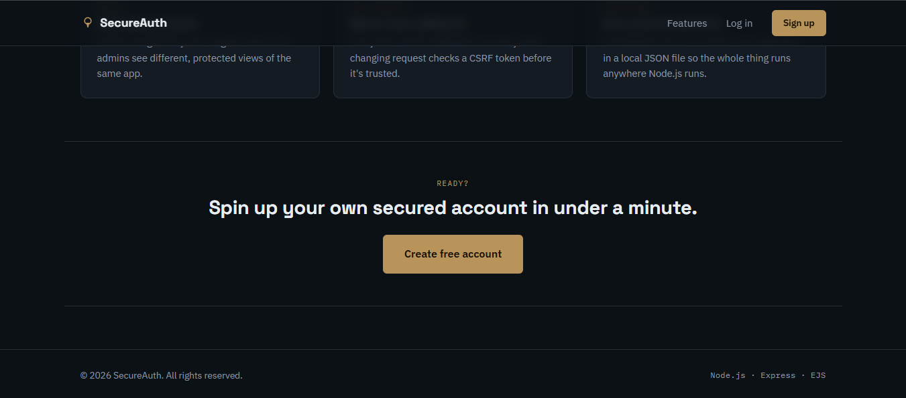

# 🔐 SecureAuth

> **A secure, modern authentication system built with Node.js, Express & EJS.**

SecureAuth is a responsive authentication website demonstrating practical security features such as password hashing, protected sessions, CSRF protection, rate limiting, account lockout, server-side validation, and role-based access control.

## ✨ Features

- 🔑 bcrypt password hashing — 12 rounds
- 🍪 HTTP-only & SameSite session cookies
- 🔄 Session regeneration after login
- 🛡️ CSRF protection
- 🚦 Login rate limiting
- 🔒 Account lockout after repeated failed attempts
- 👥 User & Admin role-based access
- ✅ Server-side validation
- 🪖 Helmet security headers
- 💾 Local JSON data storage
- 📱 Responsive desktop & mobile UI

## 🛠️ Tech Stack

**Node.js · Express.js · EJS · JavaScript · CSS · bcryptjs · express-session · express-validator · Helmet · express-rate-limit**

## 📸 Website Preview

### 🏠 Home Page


### 👤 User Dashboard


### 🛡️ Security Features


### 🔻 Footer / Call to Action



## 📁 Project Structure

```text
secure-auth-website/
├── config/
├── middleware/
├── routes/
├── views/
├── public/
├── scripts/
├── data/
├── app.js
├── package.json
├── package-lock.json
├── .env.example
├── .gitignore
└── README.md
```

## 🚀 Run Locally

```bash
git clone https://github.com/Cyberbadfit/Full-Stack-Web-Development-Projects/tree/main/secure-auth-website
cd secure-auth-website
npm install
```

Create `.env` from `.env.example` and configure your session secret.

```bash
npm start
```

Open:

```text
http://localhost:3000
```

## 🔐 Security Note

This project is designed for learning and portfolio demonstration. Before using it for real users, replace local JSON storage and the default in-memory session store with production-grade database/session infrastructure, enable HTTPS, configure strong environment secrets, and perform a security review.

## 👨‍💻 Author

**CYBERBADFIT**

© 2026 SecureAuth. All rights reserved.

---

### ⭐ SecureAuth

**Every account, properly locked.**
